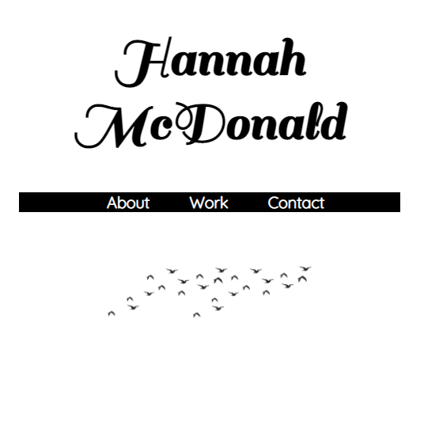

# Portfolio

Hi! Welcome to my portfolio page. 

The goal for this project was to build a welcoming and easily accessable portfolio site that is professional and visually appealing.
This site is built from scratch using HTML and CSS properties including flex box and utilizes a responsive layout for mobile devices as well. 
For this site, I created a basic layout with a header, bio section, work section, and contact links. 
I tried to also create a design that was personal to me and descriptive of my interests and hobbies.

All applications listed in the Work section, are my own application ideas that have not been created as of yet. Once I do create them, I will link them on this portfolio page.

Link to Deployed Application: https://hannahnmcdonald.github.io/Portfolio/

Desktop Screenshot:

_____________________________________________________________________________________________________________________________________________________________________
Mobile Screenshot:

Installation: N/A

Usage: Application can be viewed in a desktop browser as well as mobile devices.

Credits: Utilized Google Fonts and Font Awesome for fonts & icons

Photos: All photos are mine.

Built with: Gitbash, Github, VS Code
